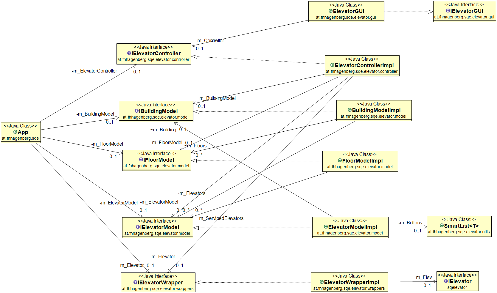

Elevator Control Center implemented in JavaFX
=============================================

[API Documentation](https://fhhagenberg-sqe-esd-ws20.github.io/elevator-control-center-team-f/target/site/apidocs)

Quick Start
-----------

* Install Java or OpenJDK.
* Download latest release [from here](https://github.com/fhhagenberg-sqe-esd-ws20/elevator-control-center-team-f/releases/).
* Double Click the downloaded *.jar file or launch via command line (`java -jar *.jar`).
* Start [Elevator Simulator](https://github.com/winterer/elevator/releases) and set up a new scenario.

The released *.jar file contains all dependencies and can be executed without further requirements.

Architectural Overview
-----------------------

