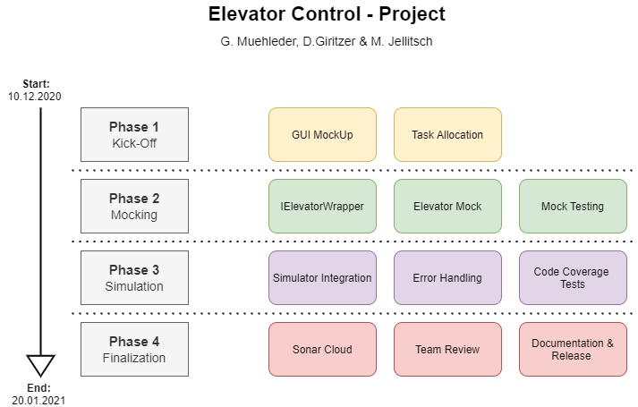
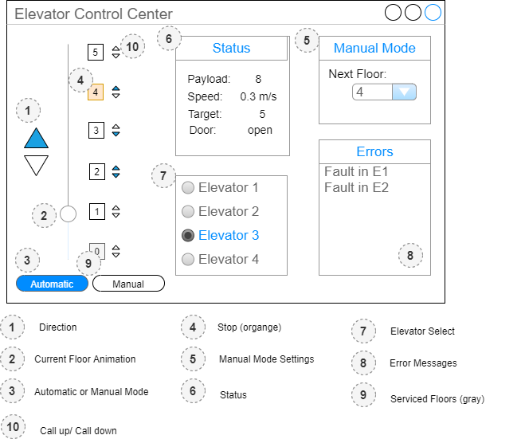
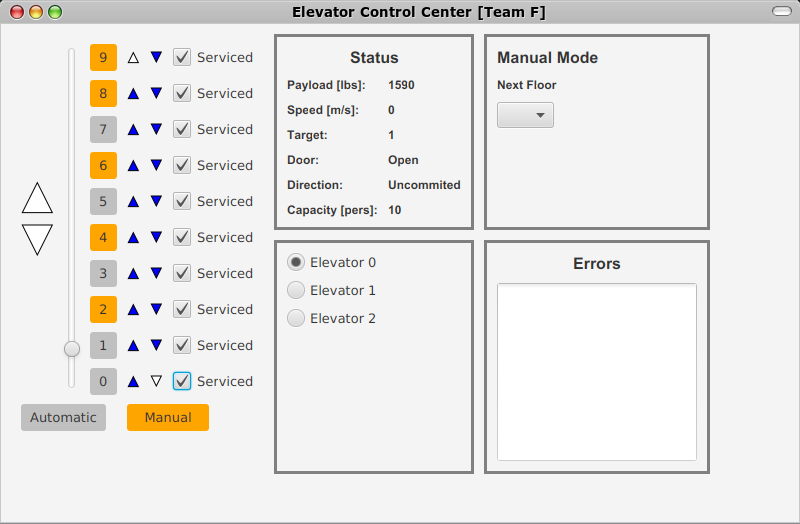
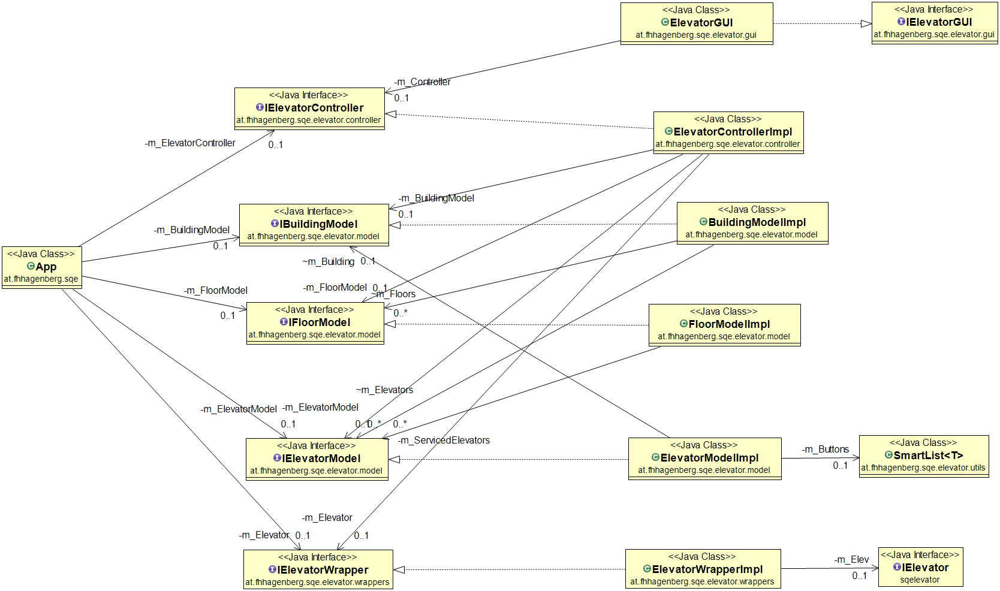

Project Summary
===============

Project Phases
--------------

The chart above shows all project phases. To ensure rapid development every phase was executed as a long and peer reviewed 
programming session similar to extreme programming. Issues were fixed as soon they came up by, this worked out quite
well due the small size of the team.

Mockup vs. Final Version
------------------------

Only small adjustments have been made especially to the "serviced floors" functionality, as his feature was not properly understood
during phase 1 of the project.

Architectural Overview
-----------------------

Lessons Learned
---------------

During the design & implementation the team members have undestood the importance of testing.
Testing is an essential part of your software project not only that it gives you a feeling about the stability of
your code, but also it offers you the chance to refactor your code without the loss of error feedback.
While we have implemented the elevator simulation and wrote tests, we have found the most errors during the test phase, e.g writing a new 
test case for a module. The software development with Java (although are not experts with this modern language) offers a huge amount of software
development tools, which helped us to finalize our project and release a stable version with a suffiecient knowledge about the code and its coverage.
Still it is indispensable to schedule regular review meetings to discuss pieces of code with your team members or verify the requirements to be
implemented. At the end we are very satisfied with the project's outcome and are very happy to say, that over 100 tests are used to verify the
software.